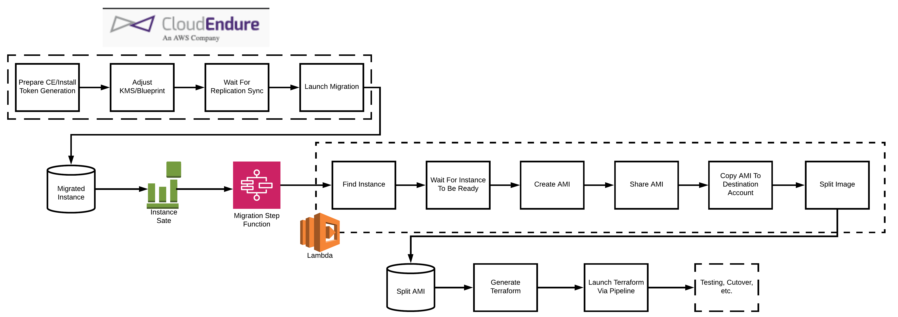
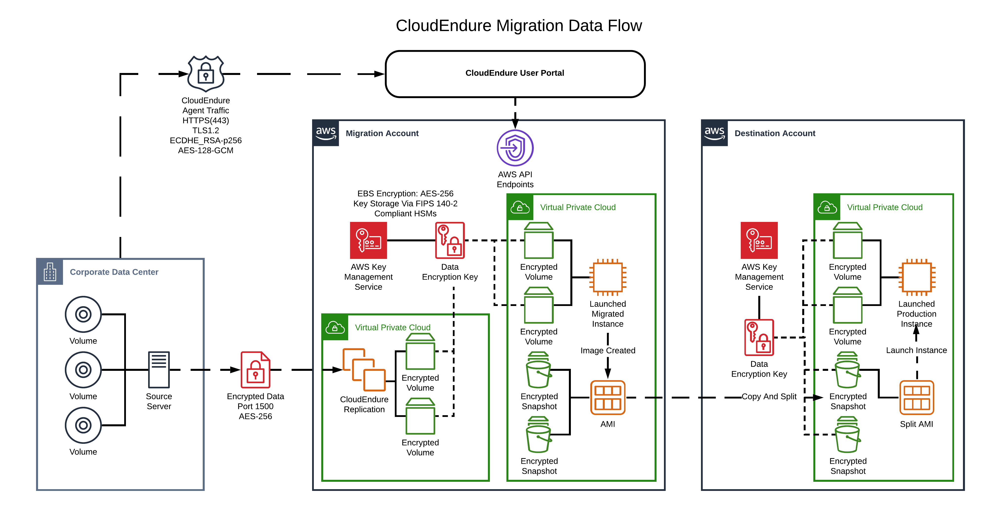

# cloudendure-python

Python wrapper and CLI for [CloudEndure](https://www.cloudendure.com/)

[ ](https://pypi.org/project/cloudendure/) [](https://2ndwatch.github.io/cloudendure-python/) [](https://2ndwatch.github.io/cloudendure-python/)

## Requirements

[Python 3.7+](https://www.python.org/downloads/)

## Installation & Usage

### pipenv

```sh
brew install pipenv # if not installed
pipenv install cloudendure
```

### pip

```sh
pip install cloudendure
```

### Usage

Then import the package:

```python
import cloudendure
```

## Getting Started

CloudEndure Pipeline Flow


CloudEndure Data Flow


### Logging in via CLI using environment variables

Please note: `cloudendure` and `ce` can be used interchangeably

```sh
export CLOUDENDURE_USERNAME=<your_ce_user>
export CLOUDENDURE_PASSWORD=<your_ce_password>
export CLOUDENDURE_DESTINATION_ACCOUNT=<destination_aws_account_id>

cloudendure api login
```

or

```sh
export CLOUDENDURE_USER_API_TOKEN=<your_ce_user_api_token>
export CLOUDENDURE_DESTINATION_ACCOUNT=<destination_aws_account_id>

ce api login
```

### Logging in via CLI inline

Please note: `cloudendure` and `ce` can be used interchangeably

```sh
cloudendure api login --user=<your_ce_user> --password=<your_ce_password>
```

or

```sh
ce api login --token=<your_ce_user_api_token>
```

Logging in for the first time will generate the `~/.cloudendure.yml` file.

## Coming Soon

This project is currently a work in progress and will actively change. This client has not yet been finalized and is entirely subject to change.

## Changelog

Check out the [CHANGELOG](CHANGELOG.md)
